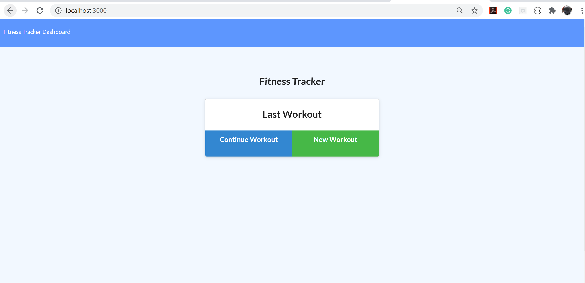
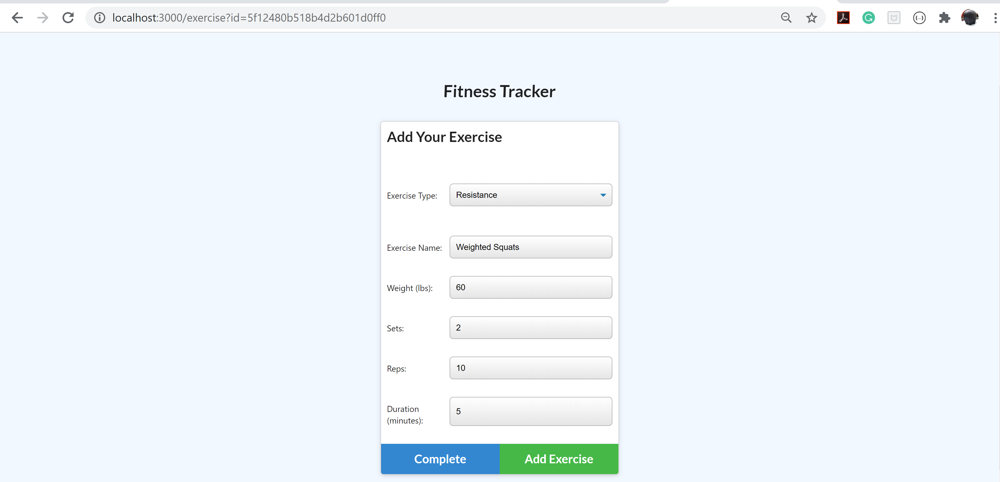
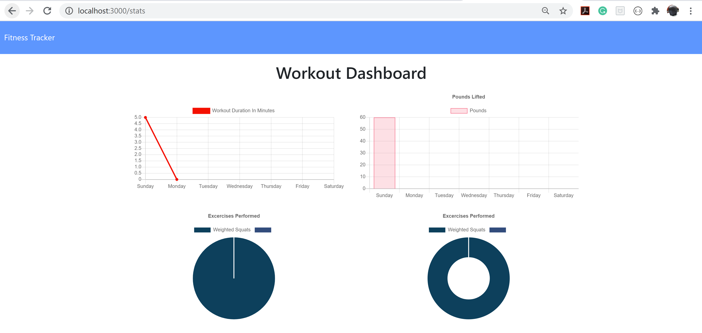

# Fitness Tracker
The Fitness Tracker app lets users save their workouts and view a dashboard where they can view all the exercises that they have completed. 

## Deployed Application 
Check out the live app by [clicking here]().

## Technology and Frameworks Used
HTML
CSS (Bootstrap)
Node 
Express 
Mongo DB 
Mongoose
Heroku 

Landing Page

Creating a workout

Viewing an added workout

Image of Workout Dashboard

## Installation : How To 
Download the Source Modules 
Make sure you have Mongo and MondoD running
NPM Install
NPM Install Express 
NPM Install Mongoose

